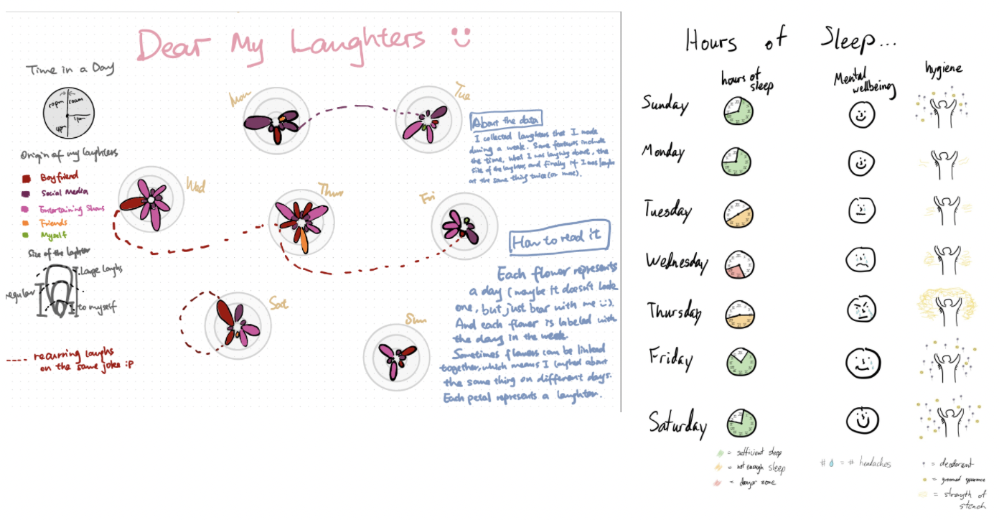
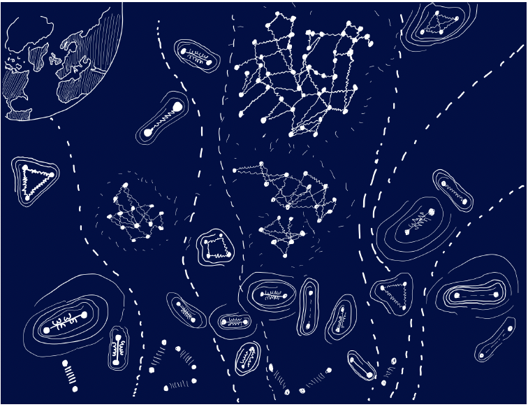
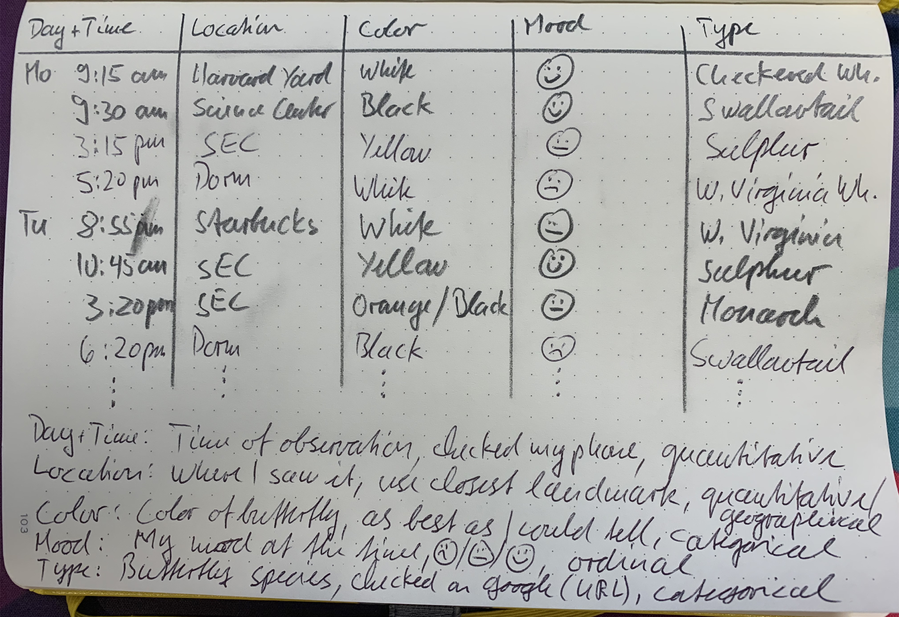

<!-----
layout: labold
exclude: true
----->

&nbsp;

# Week 04 | Homework

&nbsp;


This homework requires that you have read and programmed along with chapters 7 and 8 in *D3 - Interactive Data Visualization for the Web*.

&nbsp;

## 1) Za'atari Refugee Camp (8 points)

Za’atari is a refugee camp in Jordan that opened in 2011 to host people fleeing from the Syrian civil war. With around 80,000 refugees it is one of the largest UN-supported camps, and over the past few years, it transformed from a tent camp to a real city with water and sewage systems, markets, coffee shops etc.


*In this homework you will create two charts to present data from Za'atari in a meaningful way.*

### Data

#### Population

As part of this homework assignment we provide a CSV file with population statistics between January 2013 and November 2015. The statistics are based on active registrations in the UNHCR database.

[zaatari-refugee-camp-population.csv](https://cnobre.github.io/W25-CSC316H/week-04/hw/assets/zaatari-refugee-camp-population.csv)

#### Type of Shelter

The REACH initiative and Unicef evaluated the type of shelters in the Za'atari refugee camp. Although, the camp is gradually transforming into a real city, a lot of people still have to live in tents:

> The vast majority of households (79.68%) were recorded as living in caravans. That number was followed by 10.81% of households recorded as living in a combination of tents and caravans, while 9.51% were observed to be living in tents only.

&nbsp;

### Implementation

1. **Download the data**

	Please download the CSV data: [zaatari-refugee-camp-population.csv](https://cnobre.github.io/W25-CSC316H/week-04/hw/assets/zaatari-refugee-camp-population.csv)

2. **Set up a new D3 project and create a two-column layout in your HTML file**
	During the course of this homework you will add an area chart to the left column and a bar chart to the right column.

3. **Load the CSV file and prepare the data for the area chart**

	The *dates* are loaded as string values. Similar to numeric values (e.g. ```d.price = +d.price```) you have to convert these values. You will need *Date Objects* to create flexible *time scales* later.

	*This website should help you to convert the data into the right format: [https://github.com/d3/d3-time-format/blob/master/README.md](https://github.com/d3/d3-time-format/blob/master/README.md). Make sure to test your results before continuing.*

4. **From now on, your charts should implement the D3 margin convention**

	Create ```margin```, ```height```, and ```width``` variables and append a new SVG drawing space for the area chart to the HTML document via JavaScript.

5. **Area chart: Before you create the actual area chart, create linear scales for the x- and y-axes**

	Use the ***D3 time scale function*** for the x-axis.  It is an extension of *d3.scaleLinear()* that uses JS date objects as the domain representation.

	*Read more about D3's time scales: [https://github.com/d3/d3-scale/blob/master/README.md#time-scales](https://github.com/d3/d3-scale/blob/master/README.md#time-scales). You can (and should) always google for additional examples, if you are still unclear on the usage of D3 elements we require you to include.*

6. **Area chart: Map the population data to the area (using SVG path)**

	*Compared to a simple line chart you should fill the whole area between the data points and the x-axis.*

	To create an area chart, follow the steps below:

	a. Define a function that generates the area:

	See [https://github.com/d3/d3-shape/blob/master/README.md#areas](https://github.com/d3/d3-shape/blob/master/README.md#areas) (```d3.area()```) for details.

	b. Draw the area (using an SVG path element)

	```javascript
	let path = svg.append("path")
      .datum(data)
      .attr("class", "area")
      .attr("d", area);
	```

	c. Change the style with CSS

	If any of these steps are unclear, study some D3 area chart examples online. Make sure you understand the code before you implement it yourself!

	d. Bonus (optional): Render the actual boundary (upper line of the area chart) as line, with different visual properties.

7. **Area chart: Append the x- and y-axes and add a chart title**

	From now on, we expect that you will always label your charts, display meaningful axes, and provide a legend if necessary. Also, make sure your axes start at appropriate values.
	In data visualization we aim to create meaningful, easy-to-understand visualizations to provide insight into the data. Missing labels or axes are often a main cause for misunderstanding data!

	* Format the labeling of the x-axis to display the month and year in text format (e.g. April 2013).
	* Make sure that the labels don't overlap each other, by rotating the text labels of the x-axis.

8. **Create a compound JS data structure to store information about the shelter types**

	Store the information you have about the different shelter types in your own data structure. (As a reminder, 79.68% of households were recorded as living in caravans. 10.81% of households live in a combination of tents and caravans, while 9.51% live in tents only.)

	* Store the *type of shelter* and *percentage values*.
	* You will have to use your data structure for your bar chart afterwards, so make sure that it is as simple and efficient as possible. The actual implementation is up to you.

9. **Create a vertical bar chart for the camp's three shelter types**

	* Append a new SVG drawing area for the bar chart (using D3 margin conventions) to the right column of your webpage.
	* Map the data from your new dataset to SVG rectangles to create a vertical bar chart (refer to the screenshot in Section Implementation.1 for how it should look). The y-axis represents the percentage of people living in one of the three shelter types.
	* Usa a linear scale for the y axis.
	* For the x dimension you may choose to use either an ordinal scale or no explicit D3 scale function, as there are only 3 categories. (Note, however, that in one of the next steps you will have to add labels for each bar. Your scale implementation here affect the way you add labels later.)
	* Add a chart title.

10. **Bar chart: Draw x- and y-axes**

	*The ticks of the y-axis should be formatted as percentages.*

	[https://github.com/d3/d3-axis/blob/master/README.md](https://github.com/d3/d3-axis/blob/master/README.md)

11. **Bar chart: Append labels at the top of each bar to indicate the actual percentages**

	* Each bar should have a label to indicate the percentage, directly above the bar.
	* Each bar should also have a label with the name of the shelter type. This can be done either by using a categorical x axis, or by manually adding text labels.

12. **Create dynamic tooltips for your area chart**

	

	*There are many different ways to include tooltips. Follow the steps below for one approach, but feel free to experiment with others*

	Make sure the tooltip shows the camp's population for the current mouse position, as shown in the above animation.

	Note: This step is relatively complex, compared to the earlier steps. Add individual elements step-by-step and make sure they are working before adding on more elements. Debugging tip: during development, add color to your elements through css styles to ensure they are being rendered properly.

	* Create a group for all the tooltip elements and hide it by setting the style attribute 'display' to 'none' (Skip this step during development to make sure you are rendering things correctly). Save this element as a variable, which you will use to append text elemenet and later update the tooltip position. Give it a class name.

    * Append a vertical tooltip line to the leftmost position of the group (x=0) and that spans the full height of the svg.  Don't forget to assign the 'stroke' attr for it to render properly!

	* Append an empty SVG text element for the tooltip population value. place it 10px away from the top left corner of the group, and don't forget to give it a class or id!

    *  Append an empty SVG text element for the tooltip date value. Position this text just below
   the population text holder. Give it a unique class or id name.

	* Append a rectangle over the whole chart to capture 'mouse events'. Add listeners to 'mouseover', 'mouseout', and 'mousemove' events. On mouseover, set the display style of the tooltip group to 'null, on mouseout set it to 'none', and on mousemove, trigger a new 'mousemove' function that will handle the positioning of the tooltip.

	* ```d3.bisector```is a function that finds the closest index in an array for a given value, specifying an accessor function.  You can read more about it here: [https://github.com/d3/d3-array#bisector](https://github.com/d3/d3-array#bisector)

	* For this homework, you will need to define a bisector that returns the date attribute, such as the example below. This can then be applied as bisectDate(array, d), returning the index of  the array which contains the closest value to 'd'.

        ```javascript
        let bisectDate = d3.bisector(d=>d.date).left;
        ```

    * Write a mousemouve function with the following signature:

        ```javascript
        function mousemove(event){
            //code goes here
        }
        ```

	* Inside this function implement the following steps:

		* Use d3.pointer(event)[0] to get the x position of the mouse pointer.

	    * Use .invert on the xscale to find the equivalent date value for the x position of the
	     mouse pointer.

		* Call the previsously declared bisector function to get the index of the closest date in
		 the original data array.

		* Use the index from the previous step to grab the data element at that location.  

	    * Shift the whole tooltip group on the x-axis to the position of the mouse.

	    * Update the tooltip text properties with the date and population values

13. **Use CSS to style the webpage**

	*Spacing between charts, font size, color scheme, ...*

	This is your space to be creative! Please use at least 5 CSS styles, and keep the design guidelines you have learned so far in lecture in mind. We will actually deduct points for bad visual design, so be mindful of your fonts, colors, etc. 

&nbsp;

Congratulations on finishing your homework! Up until now, all your visualizations have been static (i.e., the initial visualization did not change after first rendering). Over the next couple of weeks you will learn how to dynamically update visualizations, and how to create dynamic transitions. You will also learn how to link two or more visualizations together, so that the interaction in one view will automatically trigger an update of the second view!

## 2) Sketching (2 points)
Go back to the pharmaceutical data that we use with Tableau. Take 15 minutes to sketch several ideas for possible visualizations to answer your questions about the pharmaceutical data. Make sure to label your axes and add titles to the visualizations. You are encouraged to use colored pens. You can sketch either with pen and paper or with a digital pen on a tablet. However, it must look like a hand-drawn sketch. Take pictures of your sketches and submit them as all in ***sketches.pdf*** as part of your HW submission.


## 3) Extra Credit: 'Dear Data' Competition: Collecting Personal Data

You have already heard about the Dear Data project in class. We will run our own CSC316 Dear Data competition this year. The winner will receive a copy of the Dear Data book (and bragging rights), but it is completely optional and up to you to join the competition or not.
If you decide to join, we ask you to observe, collect, and sketch a visualization inspired by the Dear Data project over the next two weeks. This week, you will collect personal data, and next week you will sketch a visualization that encodes this data using creative, artistic, and whimsical visual encodings inspired by the work of Georgia Lupi and Staphanie Posavec. The student with the best Dear Data visualization, as determined by our TAs, will **win a copy of the Dear Data book**!

You can receive up to 2 points of extra credit for data collection, but only if you also complete the second part of the dear data project next week.


<!---->


Here are some pictures of previous years' submissions:




<!--
-->


In determining the winner, the TAs look for creativity (in the type of data you collect, as well in your visual sketch), solid data collection, and good design.

**Why collect personal data?**

There are several reasons for collecting personal data. Spending time with your data will help you better understand yourself. It helps you reflect on what makes you you. The data you collect and the choices you make reflect your personality. It is a way to figure out what is really important to you, since measuring something means that it matters. Finally, collecting personal data is another way to document your life, just as words in a journal and images you capture are documenting your human experience.

**What data to collect**

Think about what personal data you want to collect this week. Anything that can be measured is data, and any measurement that relates to you and your life is personal data. Examples include drinks, sounds, transportation, fitness, indecision, compliments, relationships, mirrors, emotions, workspaces, sports, apologies, things you buy, laughter, complaints, food, etc. In your homework document, write down several options, and then make a final decision. Tell us why you chose to collect this particular data.

**How much data to collect**

You must collect data for **at least 5 days** with **at least 3 observations** per day, so make sure to get started early. We recommend that each data item (i.e., rows in your data table) has **at least 5 attributes** (i.e., columns in your data table), including the date and time when you collected each item. More attributes are better, especially if they are used to make connections between different data items (e.g., how people are connected, and who they are connected to).

*Example:* You decide to collect data about butterflies. Each row of your data table will be a butterfly sighting. The first attribute is the day and time of when you saw the butterfly. Other attributes (columns) in your table are where you saw it, its color, what mood you were in (using emojis), what kind of butterfly you think it was. You make sure to keep an eye out for butterflies to hopefully see at least three of them each day. If you don't, you can make a couple of sightings (but do not cheat too much).

**How to collect your data**

To collect your data we strongly suggest to use pen and paper. You can easily carry them around with you all week long, they never need power, and they are easier and more fun to use. When you are done, transfer your data into a table if it is not already in table form. Put the data items into rows and the attributes into columns.

Make sure to label each column and to **provide additional explanations for your data attributes** below your table, including at least what they mean, how you collected them, and their data type (categorical, ordinal, or quantitative).

_Example: Below is a picture of an example data table for the butterfly data, including a legend that explains each attribute._




**How to submit your data**

If you collected your data on paper, take a picture of your table and submit it with your homework. If you like, you can also transfer your data to a spreadsheet and submit it that way. A spreadsheet allows you to easily compute aggregate statistics, e.g., averages, medians, or percentages, although you can also do that with pen and paper. If you were not able to collect data over 5 days yet, don't worry, you can continue your data collection into next week (just submit the data that you have so far for this week).

## 4) Submit Homework in Quercus

Use the following recommended folder structure & create a single .zip file:


```
/submission_week_04_FirstnameLastname
    hw/
        css/ 		...folder with all CSS files
        js/ 		...folder with all JavaScript files\
        index.html
        sketches.pdf 
        
    lab/
		css/ 		
		js/ 
		index.html
		
    class_activity/
    	[pdf of your class activities]
    	[latest Tableau workbook (either added here separately or within the gdrive)]
    	
    dear_data/ (optionl)
        [picture or spreadhseet with data]
		
```

*  Make sure to keep the overall size of your submission under 5MB! Sketches don't have to be in the highest resolution, but should still be readable.

*  Upload a single .zip file.

**Congratulations on finishing this week's homework! See you in class!**
